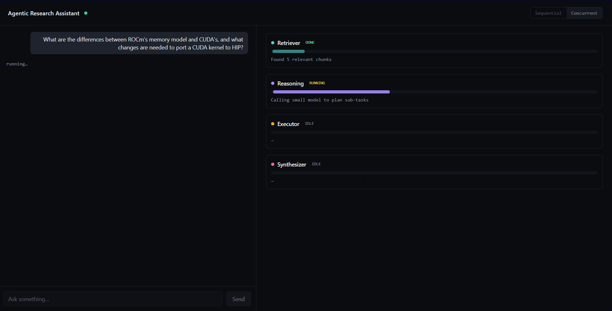
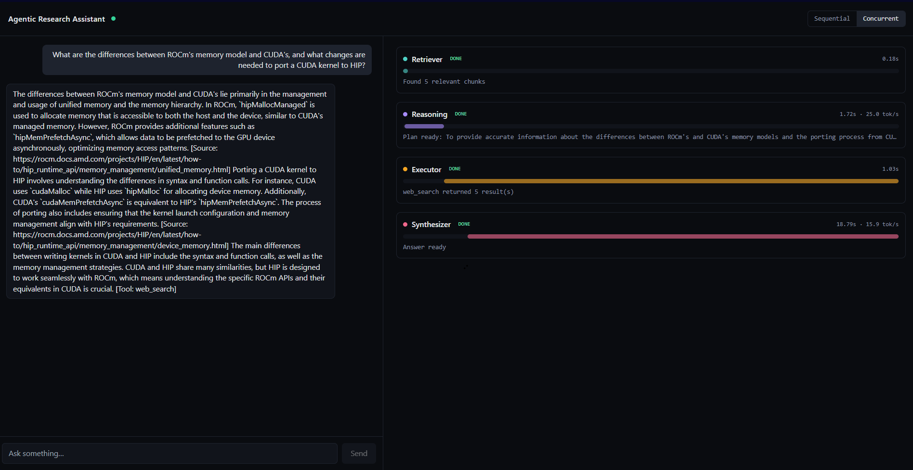

# Agentic Research Assistant

A multi-agent research assistant built for the AMD AI DevMaster Hackathon (Track 2: Agentic AI). Four specialized agents collaborate to answer research questions by combining semantic search over a local knowledge base, tool use (web search, sandboxed code execution), and LLM synthesis, running on AMD ROCm hardware via vLLM.

Built for [AMD AI DevMaster Hackathon](https://lu.ma/amd-ai-devmaster), submission deadline Aug 6, 2026.

🎥 **Demo video:** https://youtu.be/Qql5R5Qa7Eo

## Why this exists

Most agentic demos show one model doing plan → tool → observe → answer in a loop. This project asks a different question: **what happens when you have multiple agents with genuinely different jobs, and you have to decide how they share a GPU?**

That's not a hypothetical problem. A real agentic pipeline burns GPU time waiting between steps if agents run naively one after another. This project treats *agent scheduling* itself as the optimization target, not just single-model throughput.

## Architecture

Four agents, each with a distinct job:

| Agent | Job | Model size |
|---|---|---|
| **Retriever** | Semantic search over a pgvector knowledge base | none (DB-only) |
| **Reasoning** | Decomposes the query into sub-tasks, decides which tools are needed | small (3B) |
| **Executor** | Calls tools: web search (Tavily), sandboxed code execution | none / small |
| **Synthesizer** | Combines everything into a final, cited answer | large (7B, AWQ) |

**Dependency graph** (this is the real constraint, not an arbitrary choice):
- Retriever and Reasoning both only need the original query — no dependency on each other
- Executor needs Reasoning's plan
- Synthesizer needs everything

```
SEQUENTIAL (naive):
Retriever -> Reasoning -> Executor -> Synthesizer
(each agent idles while the previous one runs)

CONCURRENT (optimized):
Retriever ─┐
           ├─> Executor -> Synthesizer
Reasoning ─┘
(Retriever + Reasoning run in parallel, real dependency graph respected downstream)
```

This is the core benchmark: same query, same hardware, sequential vs concurrent execution mode, real wall-clock time and GPU utilization compared. The mode is a live toggle in the UI, not just a config flag, so it can be demonstrated directly.



**Second optimization: mixed model-size routing.** Reasoning (routing/planning) runs on a small 3B model (`Qwen2.5-3B-Instruct`). Synthesizer, which produces the actual answer a user reads, runs on a larger 7B model (`Qwen2.5-7B-Instruct-AWQ`) served as a second, independent vLLM process on the same GPU. This isn't just a config label — it's two separate model processes, each with its own memory allocation (`--gpu-memory-utilization 0.25` for the 3B, `0.5` for the 7B), routed to by size in `llm_client.py`. This mattered in practice, not just in theory: an earlier version routed both sizes to the same 3B model, and Synthesizer introduced ungrounded facts not present in retrieved context in roughly half of repeated test runs on the same query. Retrieval itself was independently verified correct; the issue was a model capability ceiling. Switching Synthesizer to the 7B model fixed it — see Known limitations for the full before/after.

### Stack

- **Backend:** FastAPI, async orchestrator, WebSocket streaming for live agent trace events
- **Frontend:** Next.js 14, live 4-lane agent trace panel, sequential/concurrent toggle
- **Retrieval:** PostgreSQL + pgvector, cosine similarity search
- **Inference:** vLLM on ROCm (AMD Radeon Cloud pod), swappable to Ollama for local CPU dev via `LLM_BACKEND` env var
- **Tools:** Tavily (web search), sandboxed subprocess execution with resource limits (code execution)
- **Containerization:** Docker Compose (postgres, redis, backend, frontend)

## Knowledge base

Scoped to AMD ROCm/HIP documentation — specifically the HIP porting guide, the HIP programming model, and the memory management docs (coherence control, host/device/unified/virtual memory). 7 source pages, 259 chunks, ingested via `scripts/ingest.py`.

This scope was chosen deliberately: "how do I port CUDA to HIP" and "how does HIP's memory model differ from CUDA's" are genuinely independent sub-questions, which makes them good material for demonstrating concurrent multi-agent execution rather than an artificially split single question.

## Running it locally

Requires Docker, Python 3.11+, and a `.env` file (copy `.env.example` and fill in).

```bash
git clone https://github.com/Yashhh0602/agentic-research-amd-scaffold
cd agentic-research-amd-scaffold
cp .env.example .env
# edit .env: set TAVILY_API_KEY, and LLM_BACKEND=ollama for local CPU dev
docker compose up
```

Frontend: `http://localhost:3001`
Backend health check: `http://localhost:8000/health`

**Local dev note:** the LLM backend is swappable. `LLM_BACKEND=ollama` runs inference against a local Ollama instance (CPU, works for logic testing, too slow for real synthesis quality on larger models). `LLM_BACKEND=vllm` points at a vLLM endpoint (see below), used for real GPU-backed inference.

## Running on AMD ROCm (vLLM)

1. Launch an AMD Radeon Cloud pod using the `ROCm vLLM-dev (Navi)` template
2. SSH in, serve both models (two separate processes, split GPU memory):
   ```bash
   vllm serve Qwen/Qwen2.5-3B-Instruct --host 0.0.0.0 --port 8000 --gpu-memory-utilization 0.25
   vllm serve Qwen/Qwen2.5-7B-Instruct-AWQ --host 0.0.0.0 --port 8001 --gpu-memory-utilization 0.5
   ```
3. Tunnel both pod ports to your local machine:
   ```bash
   ssh -L 0.0.0.0:8001:localhost:8000 -L 0.0.0.0:8002:localhost:8001 root@<pod-host> -p <pod-port>
   ```
4. Set in `.env`:
   ```
   LLM_BACKEND=vllm
   VLLM_BASE_URL=http://<your-local-lan-ip>:8001/v1
   VLLM_LARGE_BASE_URL=http://<your-local-lan-ip>:8002/v1
   ```
5. Restart the backend: `docker compose up -d --force-recreate backend` (note: `docker compose restart` does not reliably reload `.env` changes in this setup — use `up -d --force-recreate` instead)

## Benchmarks

Run the benchmark scripts against a live vLLM endpoint on the AMD ROCm pod:

```bash
python scripts/benchmark.py --query "<hero query>" --runs 5
python scripts/throughput_benchmark.py --queries 5
```

Results are logged to `proofs/` as timestamped JSON, including `rocm-smi` output where available, so numbers here are reproducible, not hand-typed.



### Throughput under concurrent load: 4.08x

The strongest result: **5 different users asking 5 different questions simultaneously**, one-at-a-time vs all fired concurrently at the same vLLM endpoint.

| | Total time (5 queries) |
|---|---|
| One-at-a-time | 125.598s |
| Concurrent batch | 30.82s |
| **Speedup** | **4.08x** |

Being direct about what this does and doesn't show: individual query latency for any single user was not faster under concurrent load — that's expected, since GPU compute is shared across simultaneous requests. What improved is total system throughput: how many different users' questions this pipeline can serve per minute. That's the metric that matters for real deployment, where multiple people query the assistant at once rather than one person waiting alone. This result reflects vLLM's continuous batching doing real work on ROCm, not the multi-agent orchestration itself. This number was re-measured after switching Synthesizer to the 7B model (see Known limitations); the earlier 3B-only setup measured 2.54x on the same test — the gap reflects the larger model's inference now dominating total latency, which increases the relative payoff of running requests concurrently rather than serially.

### Agent-level orchestration: sequential vs concurrent, 1.17x

Same query, same hardware, comparing the orchestrator's two execution modes (see Architecture above): Retriever+Reasoning running in parallel vs strictly one after another.

| | Mean total latency (5 runs) |
|---|---|
| Sequential | 21.401s |
| Concurrent | 18.363s |
| **Speedup** | **1.17x** |

This number is smaller than the throughput result, and that's expected, not a weak result to downplay: agent-level concurrency is bounded by real dependencies (Executor genuinely needs Reasoning's plan before it can start, Synthesizer genuinely needs everything). Only two of four agents (Retriever, Reasoning) have no dependency on each other, so there's a hard ceiling on how much this specific optimization can win by design, not by implementation gap. Total latency here is higher than an earlier 3B-only measurement (13.184s/11.09s) because Synthesizer now runs real 7B inference instead of reusing the fast 3B model — a direct, visible cost of the quality fix described in Known limitations. The two benchmarks together tell an honest story: orchestration-level concurrency gets a modest, dependency-bounded win, while request-level concurrency (multiple users) is where vLLM's batching shows its real strength.

**CPU (local, Ollama) baseline for reference:** sequential mean 6.581s vs concurrent mean 5.641s (1.17x speedup) — a pre-pod sanity check confirming the orchestration logic itself was correct before spending GPU-hours on it, run against the single-3B-model setup.

## Known limitations

Being direct about what this is and isn't:
- An earlier version of this project routed both "small" and "large" model calls to the same 3B model — mixed model routing was a config label, not a real architectural difference. Under that setup, the Synthesizer introduced ungrounded facts not present in retrieved context (e.g. mentioning tools/techniques never in the ingested docs) in roughly half of repeated runs on the identical query, despite strict system prompting, citation-forcing instructions, and low temperature (0.1). Retrieval itself was independently verified correct via a standalone check script before concluding this was a model capability ceiling, not a retrieval or prompt bug. Fix: switched Synthesizer to a genuinely separate, larger model (`Qwen2.5-7B-Instruct-AWQ`, its own vLLM process) — 3 clean, fully-cited runs in a row after the switch, versus roughly 50% clean before.
- Local models (3B/7B class) are not frontier-model quality. The value proposition here is deployability, cost, and data privacy for an on-prem research assistant, not raw reasoning capability competing with hosted frontier models.
- GPU access for this project was constrained to a limited hackathon credit allocation, which shaped how benchmark sessions were structured — deliberate short, focused runs rather than long exploratory sessions.
- `code_exec` sandboxing uses subprocess + resource limits, not full container isolation. Sufficient for this scope, not something to expose to untrusted input in production without further hardening.
- Each query is currently stateless by design — the project's scope prioritized the orchestration and benchmarking story (sequential vs concurrent execution, mixed model routing) over conversational features. Multi-turn memory (session-based conversation history passed into the Reasoning agent's context, backed by the Redis instance already running in the stack) is a natural next extension, not something ruled out by the architecture.

## Project structure

```
backend/app/
  agents/         retriever, reasoning, executor, synthesizer
  core/           orchestrator, llm_client, config
  api/            FastAPI routes + WebSocket
  db/             SQLAlchemy models, pgvector
  tools/          web_search (Tavily), code_exec (sandboxed)
frontend/app/     Next.js chat UI + live agent trace panel
scripts/          ingest.py (knowledge base), benchmark.py, throughput_benchmark.py
proofs/           benchmark run logs (JSON)
```
